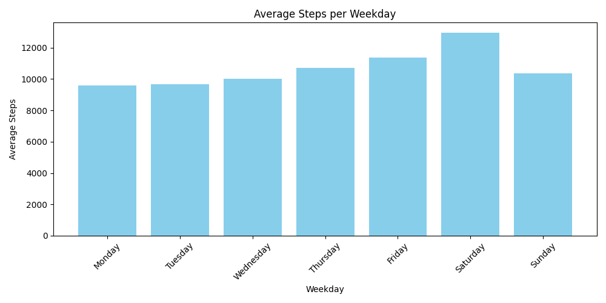
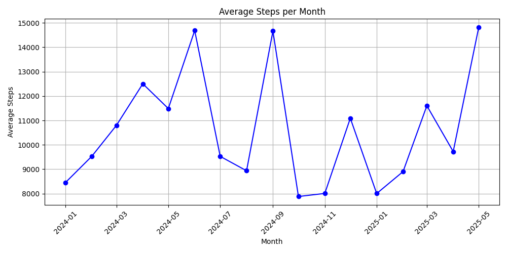

[Configuration](#configuration) |
[Target Days Summary](#target-days-summary) |
[Overall Steps Summary](#overall-steps-summary) |
[Top Days](#top-days) |
[Average Steps per Weekday](#average-steps-per-weekday) |
[Avarege Steps per Month](#average-steps-per-month)

 ### Overall Steps Summary

|     Metric          |   Value     |
|:------------------:|:-----------:|
| Days               |   478    |
| Average      |   10657     |
| Median       |   9118     |
| Top           |  61132     |
| Daily target           |  6000    |

 ### Target Days Summary

| Target Steps | Completed Days | % completed    |
|--------------|----------------|-------|
| 6000         | 478           | 100.0% |
| 8000         | 330           | 69.04% |
| 10000         | 192           | 40.17% |
| 15000         | 50           | 10.46% |
| 20000         | 29           | 6.07% |
| 30000         | 10           | 2.09% |

### Top Days

|   | Count | Date |
|---|--------------|------|
| 1 | 61132 | 2024-06-07 |
| 2 | 48150 | 2025-05-17 |
| 3 | 42723 | 2024-09-06 |
| 4 | 42669 | 2024-09-07 |
| 5 | 41547 | 2024-09-11 |
| 6 | 38271 | 2024-04-18 |
| 7 | 32628 | 2024-09-02 |
| 8 | 32158 | 2025-05-15 |
| 9 | 30641 | 2024-05-31 |
| 10 | 30128 | 2025-03-12 |

### Average Steps per Weekday

| Weekday   | Average Steps |
|-----------|----------------|
| Saturday | 12955 |
| Friday | 11355 |
| Thursday | 10708 |
| Sunday | 10348 |
| Wednesday | 9998 |
| Tuesday | 9653 |
| Monday | 9609 |

### Avg Steps per Month

# Configuration
1. **1. Download from Samsung Health -> settings -> Download personal data**
2. **Extract the zip file and copy the csv file named com.samsung.shealth.step_daily_trend.****.csv into project folder**
3. **Run the main.py script**
